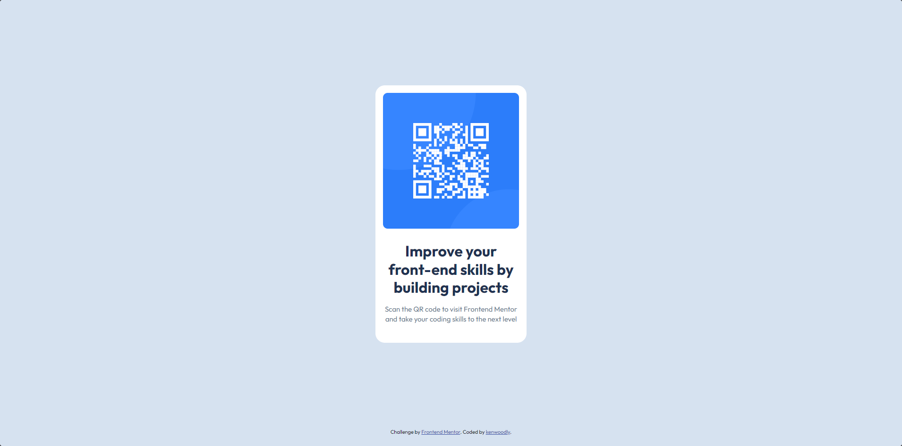

# Frontend Mentor - QR code component solution

This is my solution to the QR code component challenge on Frontend Mentor.

## Overview
This is a simple QR code component built with HTML and CSS

### Screenshot

### Links

- Solution URL: https://github.com/kenwoodly/project-qrcode
- Live Site URL: https://your-live-url.com

## Built with

- HTML5
- CSS 
- Flexbox

## Author

- Frontend Mentor - https://www.frontendmentor.io/profile/kenwoodly